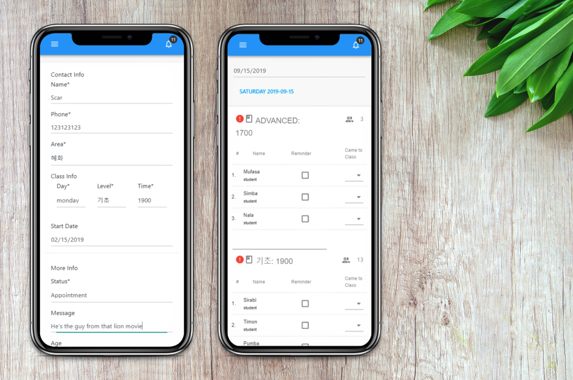
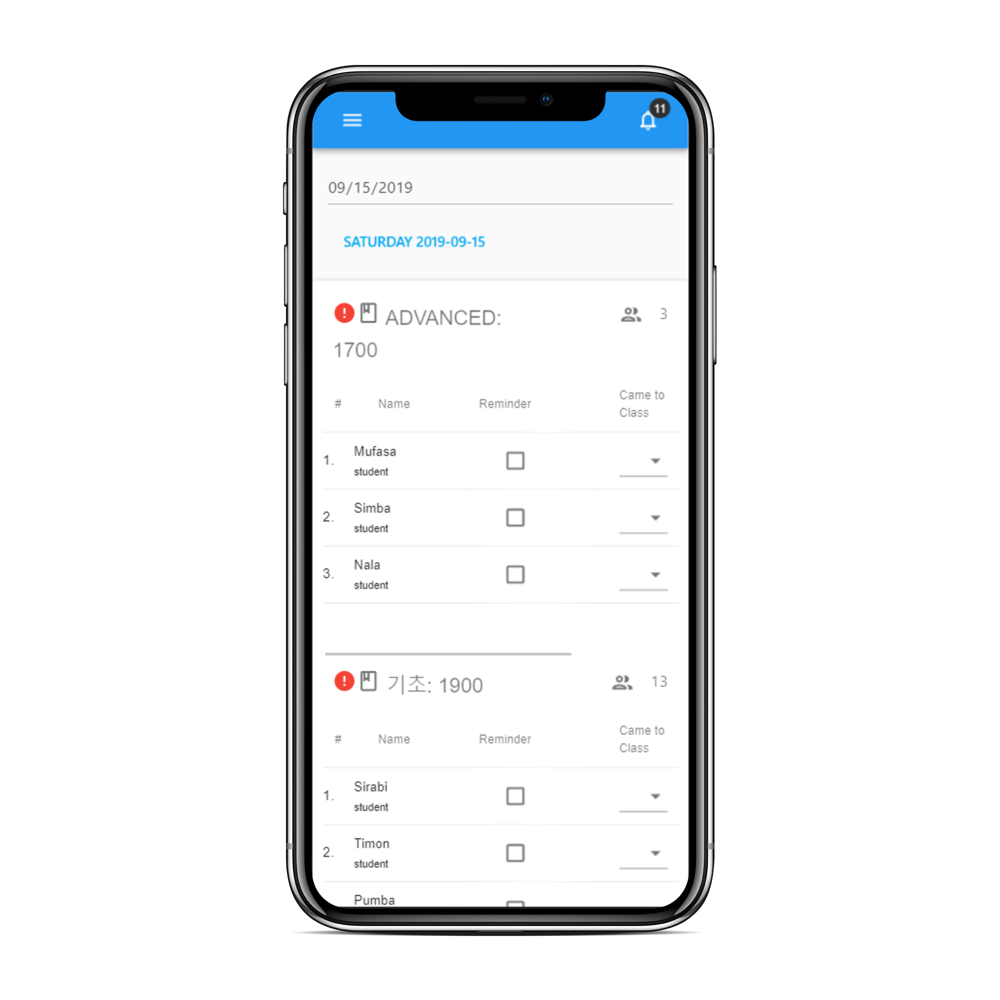

This student manager is currently used in over 100 classes, over 200 teachers, and manages over 10,000 student sign-ups for free english classes across Korea. Built from scratch using a React frontend, and a NodeJS + MongoDB backend for API's.

[row]
[col]

This was my first major web development project. I taught myself React and Nodejs and the project was ready from start to finish in the period of about two months.
[/col]
[/row]
[row]
[col]

The calendar where teachers updated reminder info, student info, and attendance.
[/col]
[col]

Stats for each class was visible weekly.
[/col]

[col]
This project included building many features from scratch including a calendar class system, attendance, stats pages, a notification system, and authentication.
[/col]
[/row]

[row]
[col]

We needed a system where teachers could easily and independently manage many new student sign-ups every day while reminding new and on-going students about class as well as tracking attendance. I also had to solve problems like allowing teachers to find students quickly in both the calendar, and in the search system. Be able to update any information quickly, and be able to transfer students to classes in different class levels, times, and even locations. Class locations were also gaining new student data from online sign-ups and other sources everyday and this manager made the process achievable.
[/col]
[/row]
