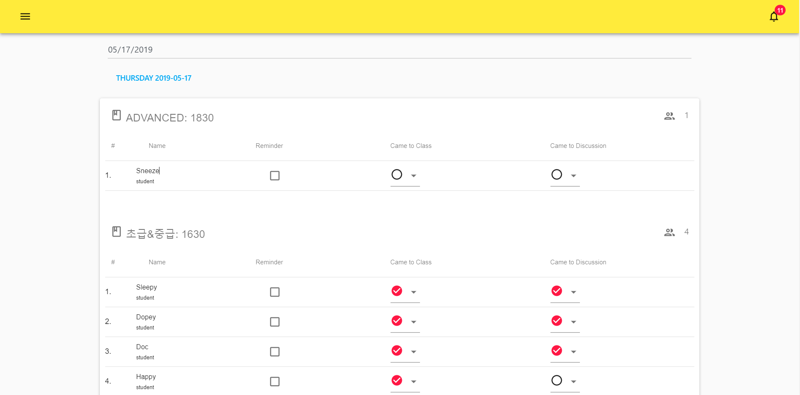
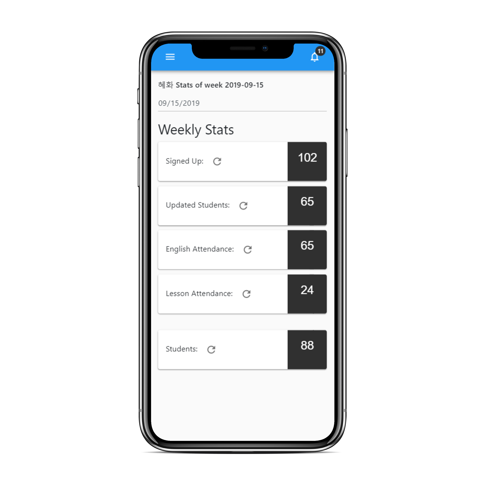

Dynamic student manager for over 100 classes, over 200 teachers, and over 10,000 student signups. This program is used by teachers to manage class times and student attendance for english classes across Korea

[row]
[col]

Lorem ipsum dolor sit amet, consectetur adipisicing elit

[/col]
[col]

Lorem ipsum dolor sit amet, consectetur adipisicing elit

[/col]
[/row]

[row]
[col]

Lorem ipsum dolor sit amet, consectetur adipisicing elit

[/col]
[/row]

[row]
[col]

Lorem ipsum dolor sit amet, consectetur adipisicing elit

[/col]
[col]

Lorem ipsum dolor sit amet, consectetur adipisicing elit

[/col]
[col]

Lorem ipsum dolor sit amet, consectetur adipisicing elit

[/col]
[/row]
