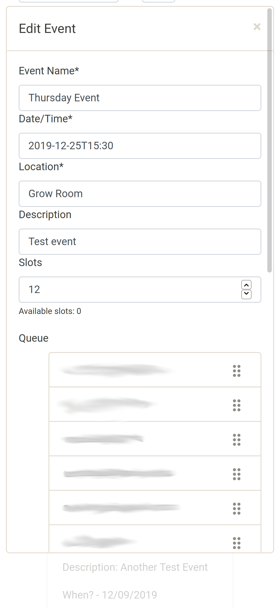

BYU Law School Event Scheduler

[row]
[col]

[/col]
[col]

[/col]
[col]

[/col]
[/row]

Notable features of this tool include event creation and joining, queue management with drag and drop, sortable events by group.

Frontend built using React and Redux. Backend built in FeathersJS with PostgreSQL.
