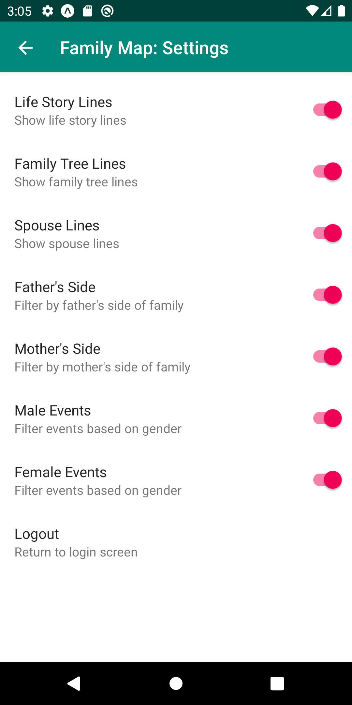

[row]
[col]

This is a project I did to learn server-side java and react native. The Java backend generates recursive family tree's stored in a SQL database. The front end displays that information in a map with filters, search abilities, etc.

[/col]
[/row]
[row]
[col]

[/col]
[col]

[/col]

[col]
The mobile app is built with react native expo with react-navigation. Features include a google maps fragment, filtering by ancestry family side, gender, etc, and a dynamic search function for all people and events in the database. The backend was built in Java with a SQL database.
[/col]
[/row]
