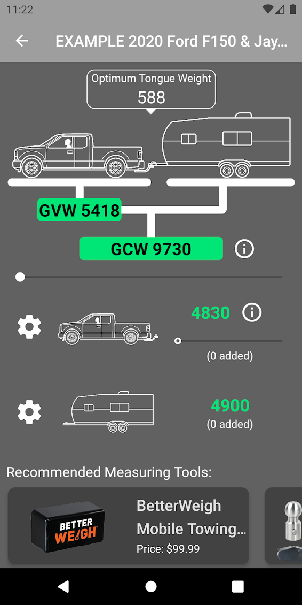
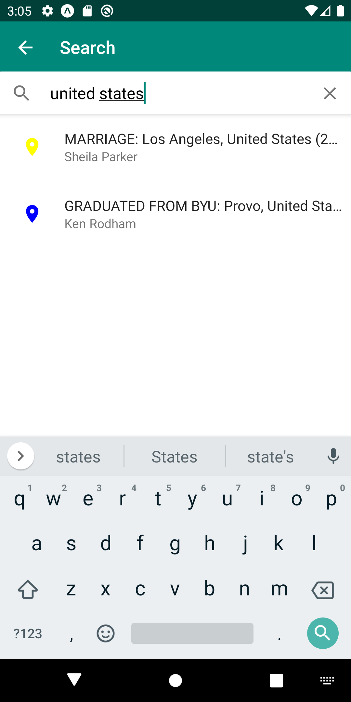
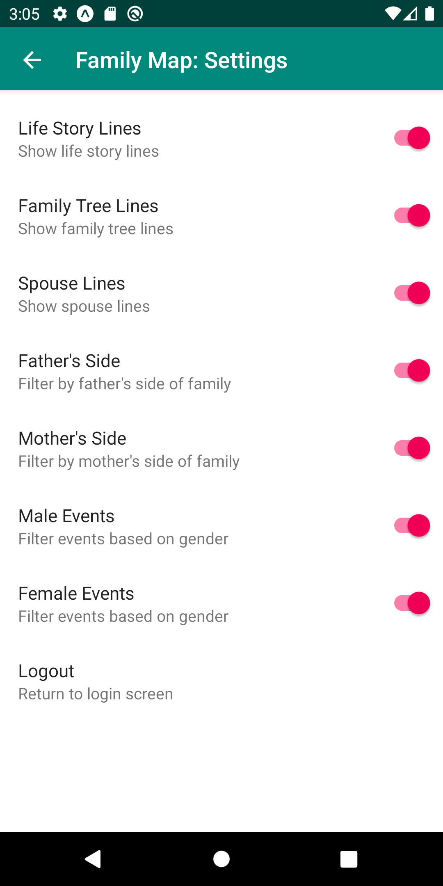

[row]
[col]

These were built using react native. 
https://play.google.com/store/apps/developer?id=Hall+Logic&hl=en-us

<!-- [/col]
[/row]
[row]
[col]

[/col]
[col]

[/col]

[col]
The mobile app is built with react native expo with react-navigation. Features include a google maps fragment, filtering by ancestry family side, gender, etc, and a dynamic search function for all people and events in the database. The backend was built in Java with a SQL database.
[/col]
[/row] -->
