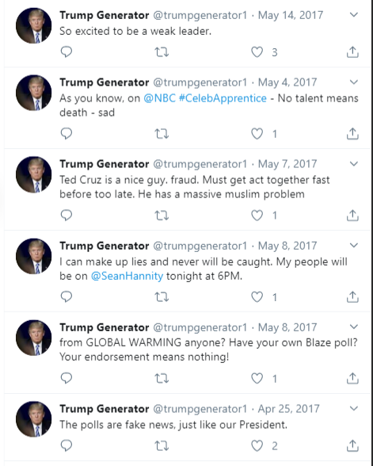
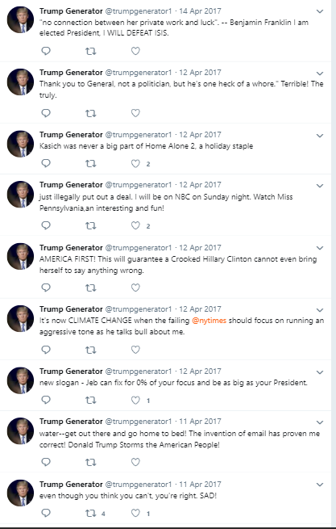

Satirical twitter account built in C++ and Python using basic artificial intelligence to make tweets that sound like Donald Trump. The logic of this twitter bot was built in C++ and python was used for posting. Follow [Here](https://twitter.com/trumpgenerator1)!

[row]
[col]

This bot posted on twitter everyday for over six months.
[/col]
[col]

[/col]  
[/row]
